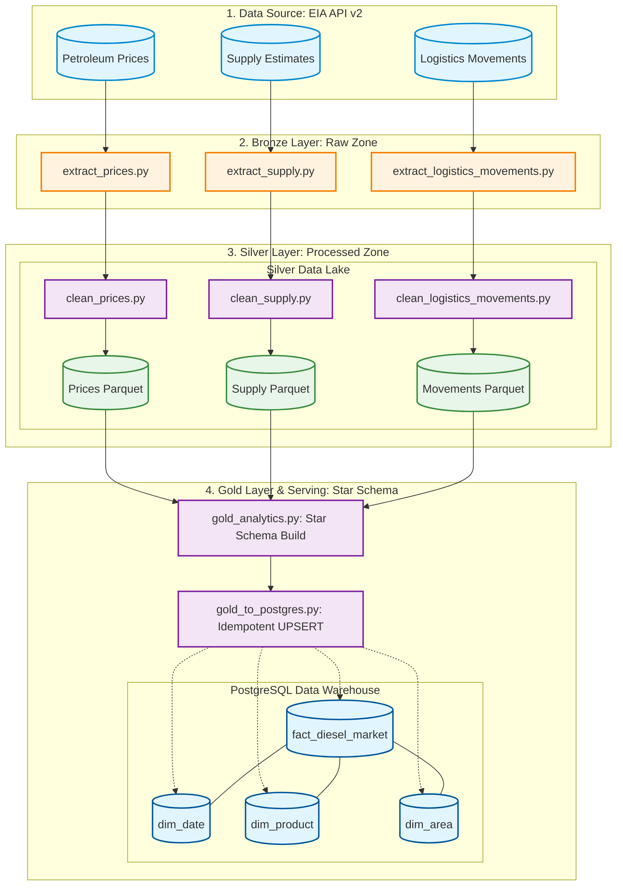

# Macro-Energy Supply Chain & Logistics Analytics Pipeline

## 📌 Project Overview
This project is an end-to-end Data Engineering pipeline designed to integrate and analyze macro-level energy supply chain data. By leveraging the **U.S. Energy Information Administration (EIA) API v2**, the pipeline orchestrates the flow of global energy metrics to provide insights into the relationship between logistics costs (Diesel prices) and energy inventory stability.

The core objective is to build a robust **Batch Processing Pipeline** that handles data extraction, quality enforcement, and complex transformations—integrating weekly price and supply metrics using temporal keys (Year-Week)—to create a unified view of the energy market.

### Key Features
* **Automated Ingestion:** Scheduled batch ingestion via REST API with configurable historical extraction.
* **Medallion Architecture:** Progressive data refinement through Bronze, Silver, and Gold layers.
* **Distributed Processing:** Leveraging **PySpark** for scalable data transformations and aggregations.
* **Data Quality (DQ) Enforcement:** Automated filtering of anomalous records (e.g., negative inventory volumes) in the Silver layer.
* **Enterprise-Grade Serving:** Automated, idempotent data loading into a **PostgreSQL** Data Warehouse using an Upsert (Merge) strategy (`ON CONFLICT DO UPDATE`).
* **Orchestration:** Managed workflow using **Apache Airflow** in a containerized environment.

## 🏗️ Architecture Diagram


The high-level data flow follows a **Batch Processing** model, orchestrated by **Apache Airflow** and executed via **PySpark**. It implements a **Medallion Architecture** within a Docker Compose environment.

The workflow can be summarized as follows:
1.  **Ingestion (Bronze):** Python scripts pull JSON data from the EIA API v2. Raw responses are stored as immutable files.
2.  **Processed Zone (Silver):** PySpark reads the raw data, enforces schemas, performs Data Quality (DQ) checks (filtering invalid records), and stores the clean data in Parquet format.
3.  **Curated Zone (Gold):** PySpark joins Price and Supply datasets using temporal keys (Year-Week) and aggregates metrics to build a complete **Star Schema** (`fact_diesel_market`, `dim_date`, `dim_product`, `dim_area`).
4.  **Serving Layer (Postgres):** A staging-to-target loading mechanism merges the Gold Parquet files into PostgreSQL using Idempotent UPSERTs, ensuring no duplicate data.

## 🛠️ Data Sources & Tech Stack

### 📊 Data Sources (EIA API v2)
The pipeline ingests data from primary routes within the U.S. EIA open data portal:
* **Petroleum Prices:** Weekly retail diesel prices (`petroleum/pri/gnd`). 
* **Supply Estimates:** Weekly estimates of ending stocks (`petroleum/sum/sndw`). Tracks inventory levels of Distillate Fuel Oil.

### 💻 Tech Stack
* **Orchestration:** [Apache Airflow](https://airflow.apache.org/) - Managing task dependencies, scheduling, and monitoring.
* **Containerization:** [Docker](https://www.docker.com/) & **Docker Compose** - Ensuring environment consistency.
* **Data Processing:** [PySpark](https://spark.apache.org/) - Distributed data transformation and Star Schema modeling.
* **Language:** [Python](https://www.python.org/) - Primary language for API ingestion and scripting.
* **Storage:** Local File System (Simulated Data Lake) - Parquet formats for Silver/Gold layers.
* **Database / Data Warehouse:** [PostgreSQL](https://www.postgresql.org/) - For serving the final Star Schema to BI tools.

## 📂 Project Structure
The repository is organized to support a scalable Data Engineering workflow.

```text
energy-supply-chain-pipeline/
├── dags/                        # Airflow Directed Acyclic Graphs (DAGs)
│   ├── energy_supply_chain_bronze.py  # Orchestrates API to Bronze ingestion
│   ├── energy_supply_chain_silver.py  # Orchestrates Silver layer transformations
│   ├── energy_supply_chain_gold.py    # Orchestrates Gold layer & Postgres loading
│   └── scripts/                 # Core logic scripts
│       ├── extract_prices.py              # Prices API extraction
│       ├── extract_supply.py              # Supply API extraction
│       ├── extract_logistics_movements.py # Logistics API extraction
│       └── spark/                         # PySpark & Data Processing
│           ├── clean_prices.py            # Silver: Prices cleaning
│           ├── clean_supply.py            # Silver: Supply cleaning & DQ checks
│           ├── clean_logistics_movements.py # Silver: Logistics cleaning
│           ├── gold_analytics.py          # Gold: Star Schema transformation
│           └── gold_to_postgres.py        # Serving: Postgres UPSERT/Merge
├── datalake/                    # Simulated Data Lake (Bronze, Silver, Gold)
├── logs/                        # Airflow execution logs
├── plugins/                     # Custom Airflow plugins
├── .env                         # Environment variables (API Keys, UID)
├── .gitignore                   # Git exclusion rules
├── docker-compose.yaml          # Infrastructure as Code (Airflow, Postgres)
├── Dockerfile                   # Custom image with PySpark/Java/Drivers
├── LICENSE                      # Project license
├── README.md                    # Project documentation
└── requirements.txt             # Python dependencies
```

## ⚙️ Data Pipeline & Medallion Layers

### 🥉 Bronze Layer (Raw Zone)
* **Status:** Immutable.
* **Process:** Data is ingested directly from the EIA API v2 and stored in its original JSON format. 
* **Goal:** To maintain a permanent historical record of the source data for auditing.

### 🥈 Silver Layer (Processed Zone)
* **Status:** Cleaned, Filtered, and Structured.
* **Process:** * Schema enforcement and data type casting (Dates, Doubles).
    * **Data Quality (DQ) Checks:** Identifies and filters out anomalous records (e.g., negative inventory volumes) to prevent pipeline failures and ensure downstream accuracy.
    * Stored as optimized Parquet files.

### 🥇 Gold Layer & Serving (Curated Zone)
* **Status:** Business-ready (Analytical Star Schema).
* **Process:** * **Modeling:** PySpark aggregates supply data and performs Inner Joins based on `Year` and `Week` keys to resolve reporting frequency misalignment (Mondays vs. Fridays).
    * **Star Schema:** Generates `fact_diesel_market` along with `dim_date`, `dim_product`, and `dim_area`.
    * **Database Loading:** Executes an automated Two-Phase Load into PostgreSQL. Data is first written to a Staging table, then merged into the Target tables using `DISTINCT ON` and `ON CONFLICT DO UPDATE` to guarantee Idempotency.

## 🚀 Setup & Installation (Airflow on Docker)

### 1. Prerequisites
* **Docker Desktop:** Allocate at least 4GB of RAM (8GB recommended for PySpark).
* **Docker Compose:** v2.14.0 or newer.
* **EIA API Key:** Register for a free API key at [eia.gov](https://www.eia.gov/opendata/).

### 2. Project Initialization
Prepare the environment by creating necessary directories:
```bash
mkdir -p ./dags ./logs ./plugins ./config ./datalake
echo -e "AIRFLOW_UID=$(id -u)" > .env
```

### 3. Configuring docker-compose.yaml
Add the `datalake` volume under `x-airflow-common:`
```yaml
volumes:
  - ${AIRFLOW_PROJ_DIR:-.}/dags:/opt/airflow/dags
  - ${AIRFLOW_PROJ_DIR:-.}/logs:/opt/airflow/logs
  - ${AIRFLOW_PROJ_DIR:-.}/config:/opt/airflow/config
  - ${AIRFLOW_PROJ_DIR:-.}/plugins:/opt/airflow/plugins
  - ${AIRFLOW_PROJ_DIR:-.}/datalake:/opt/airflow/datalake  # Add this
```

Add your API Key under the environment section:
```yaml
environment:
  - EIA_API_KEY=your_actual_api_key_here
```

### 4. Customizing the Airflow Image (Dependencies)
**Step 4.1: Create `requirements.txt`**
```text
pandas
requests
pyspark
psycopg2-binary
```

**Step 4.2: Create a `Dockerfile`**
```Dockerfile
FROM apache/airflow:3.2.0
USER root
RUN apt-get update && apt-get install -y default-jre-headless && apt-get clean
USER airflow
ADD requirements.txt .
RUN pip install -r requirements.txt
```

**Step 4.3: Build Image in docker-compose.yaml**
Comment out the default image and uncomment the build command:
```yaml
# image: ${AIRFLOW_IMAGE_NAME:-apache/airflow:3.2.0}
build: .
```

### 5. Initializing & Launching the Database
**Initialize Airflow:**
```bash
docker compose up airflow-init
```

**Start the services:**
```bash
docker compose up -d
```

### 6. Accessing the Services
* **Airflow UI:** [http://localhost:8080](http://localhost:8080) (User/Pass: `airflow` / `airflow`)
* **PostgreSQL Database:** You can connect your BI tool (e.g., Power BI, DBeaver) to the PostgreSQL container using:
    * **Host:** `localhost`
    * **Port:** `5432`
    * **Database:** `airflow`
    * **User/Pass:** `airflow` / `airflow`

### 7. Stopping and Cleaning Up
**Pause services (Keeps data):**
```bash
docker compose stop
```

**Remove environment (Complete Reset):**
```bash
docker compose down --volumes --rmi all
```
