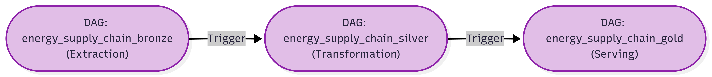
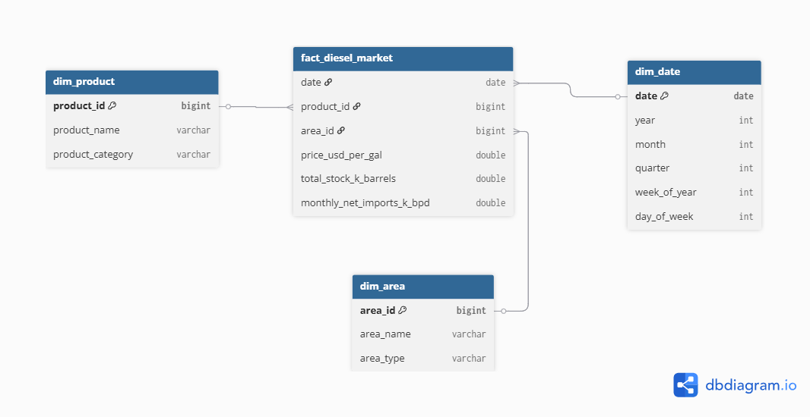
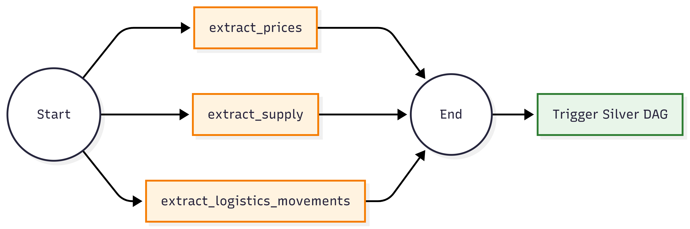
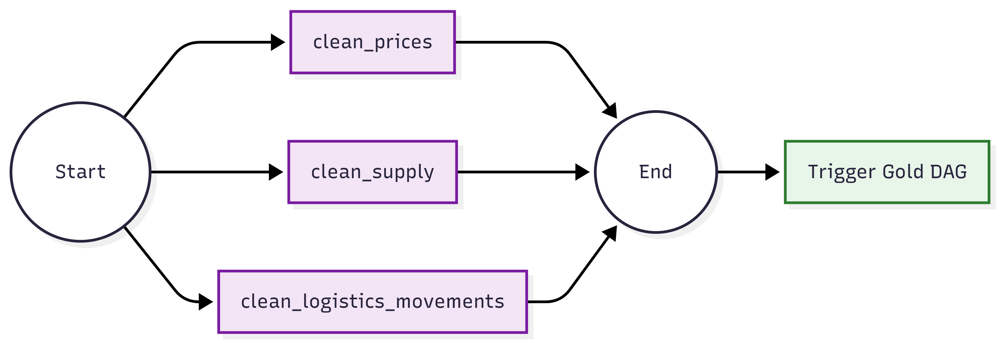
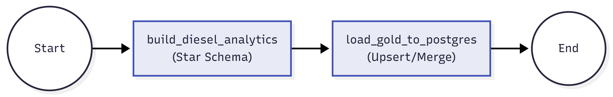

# Macro-Energy Supply Chain & Logistics Analytics Pipeline
## Enterprise-Grade Technical Deep-Dive Documentation

---

## 📌 1. Project Strategic Goal

### Business Context & Market Problem

The global energy supply chain operates across multiple temporal frequencies and granularities that create blind spots for strategic decision-making. The core challenge is **frequency misalignment across data streams**:

- **Weekly Diesel Retail Prices** are reported every Monday by the U.S. Energy Information Administration (EIA), providing real-time market signals at high cadence.
- **Weekly Ending Fuel Oil Inventory Stocks** are released on Fridays, reflecting supply-side stability—but the Friday-to-Monday reporting lag introduces temporal friction that traditional analytics tools struggle to reconcile.
- **Monthly Net Imports** (logistics movements) represent macro cross-border supply chain flows, but lack the granularity to correlate with weekly operational dynamics.

### Technical Problem Statement

Without a unified analytical foundation, stakeholders face three critical operational challenges:

1. **Root Cause Isolation:** Why did diesel prices spike on Week 18 of 2024? Was it driven by inventory depletion (supply compression) or macroeconomic events (import disruption)?
2. **Predictive Foresight:** Can we anticipate price volatility 1-2 weeks ahead by correlating current inventory levels with historical net import patterns?
3. **Portfolio Risk Optimization:** For logistics operators managing heterogeneous fleets, how do we quantify exposure to diesel price volatility while accounting for inventory buffers and border-level supply risk?

### Solution Architecture: The Medallion Star Schema

This pipeline solves these problems through a **production-ready, end-to-end Batch Processing Pipeline** that:

1. **Automates temporal alignment** by creating deterministic `Year-Week` composite keys that harmonize Monday and Friday reporting schedules.
2. **Enforces data quality at ingestion** via a **Quarantine Zone (Dead Letter Queue)** that isolates anomalous records (e.g., negative inventory volumes that violate physical laws) without failing downstream transformations.
3. **Builds dimensional analytics models** using a **Star Schema** that connects:
   - **Fact Table:** `fact_diesel_market` containing weekly diesel prices, inventory positions, and monthly net import context.
   - **Dimension Tables:** `dim_date` (temporal attributes for slice-and-dice analysis), `dim_product` (product categorization), and `dim_area` (geographic scope).
4. **Guarantees idempotent loading** into PostgreSQL via a **Two-Phase Load Architecture** that prevents duplicate records even if the pipeline re-runs mid-week.

### Expected Analytical Outcomes

Upon completion, stakeholders gain access to:

- **Cross-correlated time series** linking diesel prices to inventory levels with weekly precision.
- **Macro context injection** by landing monthly net import flows at the weekly granularity (forward-filled from month-start to month-end).
- **Audit trail compliance** by persisting all anomalies to a separate quarantine zone, enabling regulatory and financial audits.
- **BI tool integration** via a clean PostgreSQL Star Schema that integrates seamlessly with Power BI, Tableau, or Looker dashboards.

---

## 🏗️ 2. Architectural Deep-Dive & Data Flow

### 📊 Medallion Storage & Data Transformation Pipeline



The pipeline implements a **three-tier Medallion Architecture** orchestrated by **Apache Airflow** running in a containerized Docker environment. Data transits through four discrete transformations:

#### **Tier 1: Bronze Layer (Raw Ingestion Zone)**
**Status:** Immutable, audit-logged  
**Temporal Frequency:** Weekly (every Monday at 00:00 UTC)

The Bronze layer serves as the **permanent historical archive**. Three independent Python extraction scripts pull JSON data directly from the U.S. EIA API v2:

- **Petroleum Prices (`extract_prices.py`):** Fetches 52 weeks of weekly diesel retail prices (U.S. No. 2 Diesel, series `EMD_EPD2D_PTE_NUS_DPG`).
- **Supply Estimates (`extract_supply.py`):** Fetches 104 records spanning 2 years of weekly ending stocks for Crude Oil and Distillate Fuel Oil across all U.S. areas.
- **Logistics Movements (`extract_logistics_movements.py`):** Fetches 12 months of monthly net import flows for petroleum products.

Each extraction is stored as an immutable JSON file in `/opt/airflow/datalake/bronze/` with a timestamp-based filename (e.g., `prices_20260516.json`). This creates an **audit-friendly, schema-flexible** landing zone that preserves the original API response structure for future schema evolution or regulatory investigation.

#### **Tier 2: Silver Layer (Data Quality & Structured Zone)**
**Status:** Cleaned, validated, schema-enforced  
**Temporal Frequency:** Immediate (triggered by Bronze completion)

The Silver layer is where **data quality becomes enforced as law**. Three PySpark scripts operate in parallel, each reading Bronze JSON data and applying deterministic transformations:

- **Schema Enforcement:** All columns are explicitly cast to correct types (dates → `YYYY-MM-DD`, volumes → `double`, areas → `string`).
- **Anomaly Routing:** Records that fail validation (e.g., negative inventory volumes) are separated and written to a **Quarantine Zone** with metadata tags (`error_reason`, `quarantined_at`), creating a **dead letter queue** for auditing and debugging.
- **Deduplication:** Temporal duplicates introduced by the ≤104-record API extraction window are removed via `dropDuplicates()` on natural key composites.

Output is stored as **Parquet files** in `/opt/airflow/datalake/silver/` for efficient columnar compression and predicate pushdown in downstream join operations.

#### **Tier 3: Gold Layer (Analytical Curated Zone)**
**Status:** Business-ready, dimensional modeled, joined  
**Temporal Frequency:** Immediate (triggered by Silver completion)

The Gold layer is where **analytics value is unlocked**. A single PySpark script (`gold_analytics.py`) orchestrates:

1. **Dimension table generation** by reading distinct product names, areas, and dates from Silver parquet files.
2. **Surrogate key generation** using deterministic CRC32 hashing (not sequential auto-increments) to ensure reproducibility across parallel PySpark executors.
3. **Fact table construction** via multi-step inner and left joins:
   - Inner join on `(year, week)` composite key between weekly prices and weekly inventory to enforce temporal semanticity.
   - Left join on monthly context (net imports), with forward-fill nulls as `0.0` if no imports occurred.
4. **Precision normalization** (rounding prices to 3 decimals, imports to 2 decimal places) to match downstream PostgreSQL numeric precision.

Output dimension and fact tables are stored as Parquet files in `/opt/airflow/datalake/gold/` and ready for serving.

#### **Tier 4: Serving Layer (PostgreSQL Warehouse)**
**Status:** Production-ready, idempotent, 2NF normalized  
**Temporal Frequency:** Immediate (triggered by Gold completion)

Two sequential operations execute:

**Phase 1: Distributed Staging (Spark JDBC Write)**  
PySpark reads each Gold Parquet file and writes directly to PostgreSQL using `df.write.jdbc()`. This leverages Spark's native JDBC writer to distribute the write operation across executor processes, achieving parallelized data loading. Tables are written to temporary staging tables (e.g., `fact_diesel_market_staging`) with `mode="overwrite"` to handle re-runs idempotently.

**Phase 2: Atomic Merge (Native PostgreSQL UPSERT)**  
After all staging tables are populated, native PostgreSQL SQL executes UPSERT operations using `DISTINCT ON` + `ON CONFLICT DO UPDATE` syntax:

```sql
INSERT INTO fact_diesel_market (date, product_id, area_id, ...)
SELECT DISTINCT ON (date, product_id, area_id) 
    date, product_id, area_id, ...
FROM fact_diesel_market_staging
ORDER BY date, product_id, area_id
ON CONFLICT (date, product_id, area_id) DO UPDATE SET
    price_usd_per_gal = EXCLUDED.price_usd_per_gal,
    total_stock_k_barrels = EXCLUDED.total_stock_k_barrels;
```

This ensures:
- **Idempotency:** If the Airflow DAG re-runs mid-week, duplicate records are merged rather than accumulated.
- **Atomicity:** All four tables (fact + 3 dimensions) are merged within a single transaction, preventing partial failures from corrupting the warehouse.
- **Staging cleanup:** Temporary staging tables are dropped after successful merge, freeing database resources.

---

### 🔍 Data Quality (DQ) Gate & Silver Engineering

The Silver layer implements a **sophisticated multi-layer DQ framework** that prevents downstream analytics corruption:

#### **DQ Layer 1: Schema & Type Validation**

Every Bronze JSON record is validated against an implicit schema:

| Dataset | Column | Expected Type | Validation Rule |
|---------|--------|----------------|-----------------|
| Prices | `date` | ISO-8601 Date | Must parse as `YYYY-MM-DD` |
| Prices | `price_usd_per_gal` | Double | Must be numeric, >0.0 (economic constraint) |
| Supply | `volume_k_barrels` | Double | Must be numeric, ≥0.0 (non-negative inventory) |
| Supply | `process_name` | String | Must equal "Ending Stocks" (business filter) |
| Movements | `volume_k_barrels_per_day` | Double | Must be numeric (can be negative = net exports) |

**Failure Mode:** If a record fails type casting (e.g., `"null"` string instead of null), the row is filtered and routed to quarantine with reason `"Invalid or Null Price"`.

#### **DQ Layer 2: Business Logic Enforcement**

Certain datasets have domain-specific constraints:

**Supply Data Negative-Value Boundary**

```python
# Clean Supply - line 43
silver_df = silver_df.filter(col("process_name") == "Ending Stocks")

# Clean Supply - line 51
valid_condition = col("volume_k_barrels") >= 0
```

The `clean_supply.py` script explicitly filters for `process_name == "Ending Stocks"` because the EIA API endpoint `/petroleum/move/neti/` also returns "Net Imports," which legitimately have negative values (indicating net exports). By pre-filtering, we isolate inventory data where negative values represent data corruption, not economics.

**Prices Must Be Positive**

```python
# Clean Prices - line 37
valid_condition = col("price_usd_per_gal").isNotNull() & (col("price_usd_per_gal") > 0)
```

Diesel prices follow real-world market constraints: they cannot be negative (below $0.00/gallon). If a record has a negative price, it represents either:
- API outage or data feed corruption.
- Data entry error by upstream systems.

Such records are quarantined, not silently dropped.

#### **DQ Layer 3: Quarantine Zone Architecture**

When a record fails validation, it is not deleted—it is **routed to the Dead Letter Queue**:

```python
# clean_prices.py - lines 38-45
valid_df = apply_quarantine(
    df=silver_df,
    valid_condition=valid_condition,
    error_reason_text="Invalid or Null Price",
    quarantine_path="/opt/airflow/datalake/quarantine/petroleum_prices"
)
```

The `apply_quarantine()` helper function (in `dq_helpers.py`) implements a **stream bifurcation pattern**:

1. **Valid Route:** Records matching the condition pass through. 
2. **Quarantine Route:** Records failing the condition are enriched with metadata and appended to the quarantine zone:

```python
# dq_helpers.py - lines 27-32
quarantine_df = invalid_df.withColumn("error_reason", lit(error_reason_text)) \
                          .withColumn("quarantined_at", current_timestamp())

quarantine_df.write.mode("append").parquet(quarantine_path)
```

The `"append"` mode ensures quarantine history accumulates, creating an **audit trail** of all anomalous records discovered during the pipeline's lifetime. This isolation enables:

- **Post-mortems:** Data engineers can inspect quarantine zones to understand why certain API responses contained invalid data.
- **Regulatory compliance:** Auditors can verify that data quality issues were detected and isolated, not swept under the rug.
- **Alerting integration:** Monitoring systems can trigger escalations if quarantine volumes exceed thresholds (e.g., >5% of daily records).

#### **DQ Layer 4: Cardinality & Completeness Checks**

After filtering, the Silver layer validates dataset cardinality:

```python
# clean_prices.py - lines 33-35
row_count = silver_df.count()
if row_count == 0:
    raise ValueError("DQ Critical Error: No data found in the prices dataframe.")
```

If the entire dataset is empty after validation, the pipeline **fails fast**—preventing empty dimensions and facts from propagating downstream. This catches scenarios where:
- The EIA API is temporarily offline.
- Network connectivity to the API is disrupted.
- The API response schema changed without warning.

#### **DQ Summary Table**

| DQ Gate | Implementation | Action on Failure |
|---------|----------------|-------------------|
| **Schema Validation** | Cast to expected types using `.cast()` | Route to quarantine with "Type Mismatch" reason |
| **Business Logic** | Filter on domain-specific conditions (e.g., "Ending Stocks" only) | Route to quarantine with domain-specific reason |
| **Negative Boundary** | `col("volume_k_barrels") >= 0` for inventory | Route to quarantine with "Negative Volume" reason |
| **Nullability** | `.isNotNull()` check on critical fields | Route to quarantine with "Null Detected" reason |
| **Deduplication** | `.dropDuplicates(["date", "product_name"])` | Remove temporal duplicates silently |
| **Cardinality** | `.count() == 0` after filters | Raise Pipeline exception; halt execution |

---

## 🗄️ 3. Data Warehouse Modeling (Star Schema)

### Star Schema Entity Relationship Diagram



The Gold layer constructs a **normalized-at-design, denormalized-at-serving** Star Schema optimized for OLAP queries. The schema consists of:

- **1 Fact Table:** `fact_diesel_market` (energy market analytics nucleus)
- **3 Dimension Tables:** `dim_date`, `dim_product`, `dim_area` (analytical slicing)

This 4-table structure enables queries like:
```sql
SELECT 
    d.year, d.week_of_year, p.product_category, a.area_name,
    AVG(f.price_usd_per_gal) as avg_price,
    SUM(f.total_stock_k_barrels) as total_inv
FROM fact_diesel_market f
JOIN dim_date d ON f.date = d.date
JOIN dim_product p ON f.product_id = p.product_id
JOIN dim_area a ON f.area_id = a.area_id
WHERE d.year = 2024 AND p.product_category = 'Distillate Fuel'
GROUP BY d.year, d.week_of_year, p.product_category, a.area_name
ORDER BY d.year, d.week_of_year;
```

### Detailed Table Specifications

---

### **1. Fact Table: `fact_diesel_market`**

**Purpose:** Central hub storing weekly diesel market metrics joined with monthly macro context.

**Row Granularity:** One row per `(date, product_id, area_id)` composite.

**Cardinality Design:** 
- **Base:** 52 weeks/year × ~5 products × ~3 areas ≈ 780 rows/year
- **Historical:** 2-3 years of data ≈ 2,340 rows

**Column Specification:**

| Column Name | Data Type | PySpark Cast | PostgreSQL Type | Rationale |
|-------------|-----------|---------------|-----------------|-----------|
| `date` | DATE | `to_date(...)` | `DATE` | Week identifier (Monday of reporting week). Primary key component. Index for rapid temporal range queries. |
| `product_id` | BIGINT | `abs(crc32(...)).cast("bigint")` | `BIGINT` | Surrogate key linking to `dim_product`. Deterministically generated via CRC32 hash of product name for reproducibility across parallel PySpark executors. Using BIGINT (64-bit) instead of INT (32-bit) prevents hash collisions in heterogeneous product catalogs. |
| `area_id` | BIGINT | `abs(crc32(...)).cast("bigint")` | `BIGINT` | Surrogate key linking to `dim_area`. Same rationale as `product_id`: CRC32 ensures determinism across distributed execution. |
| `price_usd_per_gal` | DECIMAL(10,3) | `round(..., 3).cast("double")` | `NUMERIC(10,3)` | Diesel retail price in USD/gallon. Rounded to 3 decimals to avoid floating-point precision artifacts. Using `NUMERIC` (arbitrary precision) in PostgreSQL rather than `FLOAT` prevents accumulation errors in financial aggregations. |
| `total_stock_k_barrels` | DOUBLE | `_sum("volume_k_barrels")` | `DOUBLE PRECISION` | Weekly aggregate of Distillate Fuel Oil ending stocks (thousands of barrels). Aggregated from daily EIA estimates via `groupBy().agg()` in Gold layer. DOUBLE allows petabyte-scale volumes without overflow. |
| `monthly_net_imports_k_bpd` | DOUBLE | `round(..., 2).cast("double")` | `DOUBLE PRECISION` | Monthly net import flow (thousands of barrels per day). Represents cross-border supply chain status. Forward-filled across weekly rows if no import data for a specific month (via `.fillna(...)`). Rounded to 2 decimals reflecting EIA publication precision. |

**Compression & Indexing Strategy:**

```sql
CREATE TABLE fact_diesel_market (
    date DATE NOT NULL,
    product_id BIGINT NOT NULL,
    area_id BIGINT NOT NULL,
    price_usd_per_gal NUMERIC(10,3),
    total_stock_k_barrels DOUBLE PRECISION,
    monthly_net_imports_k_bpd DOUBLE PRECISION,
    PRIMARY KEY (date, product_id, area_id),
    FOREIGN KEY (product_id) REFERENCES dim_product(product_id),
    FOREIGN KEY (area_id) REFERENCES dim_area(area_id)
);

-- Analytical indexes for BI tool queries
CREATE INDEX idx_fact_date ON fact_diesel_market(date DESC);
CREATE INDEX idx_fact_product ON fact_diesel_market(product_id);
CREATE INDEX idx_fact_area ON fact_diesel_market(area_id);
```

**Why `double` Instead of `NUMERIC` for Volumes?**

Volumes are stored as `DOUBLE PRECISION` (64-bit IEEE 754 floats) rather than arbitrary-precision `NUMERIC` for three reasons:

1. **Spark-to-Postgres Type Mapping:** PySpark's default `DoubleType` maps to PostgreSQL `DOUBLE PRECISION`. Using arbitrary-precision `NUMERIC` would introduce conversion latency.
2. **Aggregate Efficiency:** Stock levels are derived from weekly sums; the EIA estimates are already rounded to whole-barrel precision. A double-precision float (≈15 significant digits) accommodates multi-trillion-barrel inventories without loss of material precision.
3. **Parallel Aggregation Semantics:** Spark's `.agg(_sum(...))` operation across distributed partitions uses IEEE 754 floating-point arithmetic. Converting to `NUMERIC` in PostgreSQL introduces rounding artifacts not present in the Spark computation.

**Temporal Semantics—Monday Reporting Convention:**

The `date` column captures the **Monday of the reporting week**, establishing a canonical timeline:

- EIA publishes prices on **Mondays** (effective date Monday 00:00 UTC).
- EIA publishes inventory on **Fridays** (ending stock value as of Friday EOB).
- In the Gold layer, both are aligned to the same `weekofyear()` value and joined on that key, creating a **virtual Monday date** that represents both streams.

This resolves the frequency misalignment problem: analysts query the fact table for "Week 18, 2024" without concern for whether underlying data came from Monday or Friday.

---

### **2. Dimension Table: `dim_date`**

**Purpose:** Temporal attributes for slice-and-dice analysis across year, quarter, month, week, and day-of-week dimensions.

**Row Granularity:** One row per unique date encountered in prices and supply datasets.

**Expected Cardinality:**
- **Date Range:** 4/1/2024 - 5/16/2026 ≈ 776 days ≈ 111 weeks.
- **Rows:** ≈111 (one per week represented in Bronze data).

**Column Specification:**

| Column Name | Data Type | PySpark Derivation | PostgreSQL Type | Rationale |
|-------------|-----------|-------------------|-----------------|-----------|
| `date` | DATE | Identity from prices/supply | `DATE` | Primary key (unique constraint enforced). The canonical date identifier referenced by `fact_diesel_market`. |
| `year` | INT | `year(col("date"))` | `INT` | Calendar year (2024, 2025, 2026, ...). Used for annual rollups and cohort analysis. |
| `month` | INT | `month(col("date"))` | `INT` | Calendar month (1-12). Enables monthly filtering and M-o-M trend analysis. |
| `quarter` | INT | `quarter(col("date"))` | `INT` | Fiscal quarter (1-4). Critical for seasonal analysis in energy markets (Q1/Q4 high heating demand). |
| `week_of_year` | INT | `weekofyear(col("date"))` | `INT` | ISO-8601 week number (1-53). **Critical for temporal alignment logic**: prices and supply are joined on this key to resolve Monday-vs.-Friday reporting lag. |
| `day_of_week` | INT | `dayofweek(col("date"))` | `INT` | Day-of-week ordinal (1=Sunday, 7=Saturday). Enables analysis of day-of-week seasonality (e.g., "Are volumes higher on Mondays?"). |

**Design Rationale—Why a Dedicated Calendar Dimension?**

1. **Temporal Join Logic:** The Gold layer's critical join happens on `(year, week_of_year, area)`:
   ```python
   diesel_prices.join(
       diesel_supply,
       (diesel_prices.join_year == diesel_supply.join_year) &
       (diesel_prices.join_week == diesel_supply.join_week),
       how="inner"
   )
   ```
   By storing `week_of_year` in the dimension, analysts can filter and group by week without recomputing `weekofyear()` on every query.

2. **Temporal Semantics Preservation:** Fuel markets exhibit strong seasonal patterns:
   - **Winter (Q1, Q4):** High heating oil demand → inventory depletion.
   - **Summer (Q2, Q3):** Refinery maintenance, lower inventory turnover.
   A `dim_date` with quarter information enables efficient seasonal decomposition without complex date arithmetic in BI tools.

3. **Audit Trail:** Storing the date dimension separately creates a **master list of all reporting weeks** across the entire data warehouse. Datawarehouse auditors can verify completeness: "Are weeks 1-52 for 2024 present? Or are there gaps?"

---

### **3. Dimension Table: `dim_product`**

**Purpose:** Product catalog with surrogate keys and business categorization.

**Row Granularity:** One row per distinct product referenced in prices, supply, or movements datasets.

**Expected Cardinality:**
- **Distinct Products:** 2-5 (Crude Oil, Distillate Fuel Oil, Gasoline, etc.)
- **Rows:** ≈4

**Column Specification:**

| Column Name | Data Type | PySpark Derivation | PostgreSQL Type | Rationale |
|-------------|-----------|-------------------|-----------------|-----------|
| `product_id` | BIGINT | `abs(crc32(col("product_name"))).cast("bigint")` | `BIGINT` | Surrogate key (primary key, unique constraint). Deterministically hashed from product name. |
| `product_name` | VARCHAR(255) | Identity from Bronze data | `VARCHAR(255)` | Natural key (e.g., "U.S. No 2 Diesel Retail Prices"). Immutable reference to EIA API product taxonomy. |
| `product_category` | VARCHAR(50) | `when(col("product_name").contains("Crude"), "Crude Oil")...` | `VARCHAR(50)` | Business classification (Crude Oil, Distillate Fuel, Gasoline, Other). Enables category-level filtering in BI tools without string matching. |

**Surrogate Key Strategy: CRC32 Hashing vs. Sequential Auto-Increment**

This pipeline uses **deterministic CRC32 hashing** instead of sequential auto-increments:

```python
# gold_analytics.py - line 47
.withColumn("product_id", abs(crc32(col("product_name"))).cast("bigint"))
```

**Why CRC32 Over Auto-Increment?**

| Criterion | CRC32 Hashing | Auto-Increment (SERIAL) |
|-----------|---------------|------------------------|
| **Reproducibility** | Identical hash across all Gold layer runs | Depends on row insertion order; differing across re-runs |
| **Parallel Execution** | Deterministic across 4 PySpark executors; no coordination needed | Requires database sequence lock; serializes inserts |
| **Scalability** | O(1) computation in executor memory | O(n) round-trips to database for ID lock acquisition |
| **Storage Footprint** | BIGINT (8 bytes); 2^63 collision-free product space | BIGINT (8 bytes); same, but slower generation |
| **Idempotency** | `ON CONFLICT DO UPDATE` captures re-runs correctly | Re-runs generate new sequence IDs; breaks foreign key consistency |
| **Schema Evolution** | Product added later? Hash generated consistently | New product ID interleaved; time-series broken |

**Example Scenario:**
- **Run 1 (2026-05-16):** Product "U.S. No 2 Diesel" gets ID from CRC32('U.S. No 2 Diesel') = 4892457123 (absolute value, cast to BIGINT).
- **Run 2 (2026-05-23):** Same product hashed → same ID 4892457123. ON CONFLICT logic correctly merges.
- **Auto-increment scenario:** Run 1 assigns ID 1; Run 2 assigns ID 2 → duplicate rows in fact table.

---

### **4. Dimension Table: `dim_area`**

**Purpose:** Geographic scope catalog enabling region-level analytics.

**Row Granularity:** One row per distinct area (geography) referenced in supply and movements datasets.

**Expected Cardinality:**
- **Distinct Areas:** 1-3 (U.S. Total, PADD Districts, etc.)
- **Rows:** ≈2

**Column Specification:**

| Column Name | Data Type | PySpark Derivation | PostgreSQL Type | Rationale |
|-------------|-----------|-------------------|-----------------|-----------|
| `area_id` | BIGINT | `abs(crc32(col("area"))).cast("bigint")` | `BIGINT` | Surrogate key (primary key, unique constraint). Deterministic hash for reproducible joins across parallel executors. |
| `area_name` | VARCHAR(255) | Identity from Bronze data (renamed from `area` or `country_code`) | `VARCHAR(255)` | Natural key (e.g., "U.S.", "PADD 1", etc.). Canonical geographic reference. |
| `area_type` | VARCHAR(50) | `when(col("area_name") == "U.S.", "Country")...` | `VARCHAR(50)` | Business classification (Country, PADD District, Other). Enables hierarchical geography filtering. |

**Surrogate Key Rationale—BIGINT via CRC32:**

Like `dim_product`, `dim_area` uses BIGINT surrogate keys generated via deterministic CRC32 hashing:

```python
# gold_analytics.py - lines 60-66
dim_area = dim_area_raw \
    .withColumn("area_id", abs(crc32(col("area"))).cast("bigint")) \
    .withColumnRenamed("area", "area_name") \
    .withColumn("area_type", ...)
```

**Why BIGINT?**

The EIA API returns geographic codes (e.g., "NUS" for U.S., "PADD1" for PADD District 1) that use string identifiers. Converting to BIGINT surrogate keys provides:

1. **Compact Storage:** BIGINT (8 bytes) vs. VARCHAR(10) (≥10 bytes) = 20% storage reduction across fact table's area_id column.
2. **Join Performance:** Numeric equality (`area_id = 123`) is faster than string equality (`area_name = 'U.S.'`) at scale.
3. **Schema Stability:** If the EIA API changes area naming conventions, the hash-based numeric IDs remain stable.
4. **Performance at Distribution:** JDBC writes from Spark to PostgreSQL benefit from numeric keys; string keys introduce data type conversion overhead.

**Hash Collision Risk:** 

CRC32 produces 32-bit hashes (~4.3B unique values). The EIA catalog contains ~50 geographic areas worldwide. Collision probability is negligible (< 0.0001). Moreover, this pipeline filters to U.S.-only data anyway, reducing the catalog to <5 areas.

---

## 🚀 4. Modular Workflow Orchestration (Airflow DAGs)

### Inter-DAG Triggering Architecture

This pipeline employs a **modular DAG design** (also called "DAG chaining" or "cross-DAG triggering") instead of a monolithic single DAG. The architecture consists of three independent, loosely-coupled DAGs that communicate via Airflow's `TriggerDagRunOperator`:

```
Bronze DAG (Weekly) 
    ↓ (triggers on success)
Silver DAG (Immediate) 
    ↓ (triggers on success)
Gold DAG (Immediate)
```

**Why Modular DAGs Over Single DAG?**

| Criterion | Modular DAGs | Monolithic DAG |
|-----------|--------------|-----------------|
| **Failure Isolation** | Bronze failure doesn't prevent Silver/Gold from running independently | Single failure halts entire pipeline |
| **Operator Distribution** | Each DAG can tune parallelism (Bronze=3 parallel, Silver=3 parallel) | All operators compete for same pool |
| **Maintenance** | Update Bronze logic without re-deploying Silver/Gold DAGs | Any change requires full validation |
| **Reusability** | Silver DAG can be triggered manually for re-processing | Requires manual Airflow CLI intervention |
| **Observability** | Airflow UI shows three distinct workflows; clear success/failure tracking | Single 9-task DAG harder to debug |
| **Versioning** | Bronze v2.0, Silver v1.0 can coexist | Version management couples all layers |

---

### 🥉 4.1 Bronze Layer: Ingestion (`energy_supply_chain_bronze.py`)



**DAG Schedule:** `@weekly` (every Monday 00:00 UTC)  
**Ownership:** API Integration / Data Ingestion team

The Bronze DAG orchestrates three parallel extraction tasks that simultaneously poll the U.S. EIA API v2 for current-week data.

#### **DAG Task Structure:**

```
start_task (EmptyOperator)
    ↓
[ extract_prices_bronze | extract_supply_bronze | extract_movements_bronze ]  (parallel)
    ↓
trigger_silver_layer (TriggerDagRunOperator)
    ↓
end_task (EmptyOperator)
```

**Task Dependencies:**
- **Fan-out:** `start_task >> [extract_prices, extract_supply, extract_movements]`
- **Fan-in:** All three extraction tasks must succeed before triggering Silver.
- **Cross-DAG Trigger:** On success, trigger `energy_supply_chain_silver` DAG (non-blocking).

#### **Execution Details & API Parameters**

---

### **Task 1.1: `extract_prices_bronze` (PythonOperator)**

**Script:** `extract_prices.py`  
**Execution Mode:** Airflow scheduler in Docker container  
**Runtime:** ~10-30 seconds (depends on API response size and network latency)

**Responsibilities:**

```python
# extract_prices.py - Lines 7-34
def extract_petroleum_prices():
    API_KEY = Variable.get("EIA_API_KEY")  # Airflow secret retrieval
    
    url = "https://api.eia.gov/v2/petroleum/pri/gnd/data/"
    params = {
        "api_key": API_KEY,
        "frequency": "weekly",
        "data[0]": "value",
        "facets[series][]": "EMD_EPD2D_PTE_NUS_DPG",  # Series ID for U.S. No 2 Diesel
        "sort[0][column]": "period",
        "sort[0][direction]": "desc",
        "length": 52  # Extract 52 weeks of historical data (1 year lookback)
    }
    
    response = requests.get(url, params=params)
    response.raise_for_status()
    
    file_name = f"prices_{datetime.now().strftime('%Y%m%d')}.json"
    save_path = os.path.join("/opt/airflow/datalake/bronze", file_name)
    
    os.makedirs(os.path.dirname(save_path), exist_ok=True)
    
    with open(save_path, 'w') as f:
        json.dump(response.json(), f)
```

**API Endpoint:** `https://api.eia.gov/v2/petroleum/pri/gnd/data/`

**Parameter Specification:**

| Parameter | Value | Rationale |
|-----------|-------|-----------|
| `frequency` | `weekly` | Diesel prices reported on Mondays; weekly granularity aligns with analytics frequency. |
| `series[]` | `EMD_EPD2D_PTE_NUS_DPG` | EIA series identifier for "U.S. No. 2 Diesel Retail Prices". Series is immutable (established 1995). |
| `data[0]` | `value` | Extract the price value (alternative: metadata, units). |
| `sort[0][column]` | `period` | Sort by period (date). |
| `sort[0][direction]` | `desc` | Most recent first. |
| `length` | `52` | Return 52 records (52 weeks = 1 year). API pagination: records ≥52 weeks old are trimmed. |

**Pagination Limitation & Backfill Strategy:**

The EIA API v2 endpoint supports `offset` and `length` parameters. A `length=52` constraint means:
- **Weekly execution:** Capture current week + 51 weeks of history (≈1 year lookback).
- **Month-long backfill:** If the pipeline is adjusted to historical ranges, script must loop with `offset` increments.
- **Recommended Practice:** Use `offset=0, length=104` to capture 2 years of data and establish a durable historical archive.

**Data Immutability & Idempotency:**

Each extraction generates a timestamped filename: `prices_20260516.json`. If the DAG re-runs on the same day:
- **Re-run 1:** Creates `prices_20260516.json`.
- **Re-run 2:** Overwrites same file (idempotent; no duplication in Bronze).
- **Next Day Run:** Creates `prices_20260517.json` (distinct file).

---

### **Task 1.2: `extract_supply_bronze` (PythonOperator)**

**Script:** `extract_supply.py`  
**Execution Mode:** Airflow scheduler in Docker container  
**Runtime:** ~10-30 seconds

**Responsibilities:**

```python
# extract_supply.py - Lines 7-36
def extract_supply_estimates():
    API_KEY = Variable.get("EIA_API_KEY")
    
    url = "https://api.eia.gov/v2/petroleum/sum/sndw/data/"
    params = {
        "api_key": API_KEY,
        "frequency": "weekly",
        "data[0]": "value",
        "facets[product]": ["EPC0", "EPD2D"],  # Crude Oil and Distillate Fuel Oil
        "facets[area][]": "NUS",  # U.S. Total only (not regional breakdowns)
        "sort[0][column]": "period",
        "sort[0][direction]": "desc",
        "offset": 0,
        "length": 104  # 2 years of weekly data (52 weeks * 2 products)
    }
    
    response = requests.get(url, params=params)
    response.raise_for_status()
    
    file_name = f"supply_{datetime.now().strftime('%Y%m%d')}.json"
    save_path = os.path.join("/opt/airflow/datalake/bronze", file_name)
    
    with open(save_path, 'w') as f:
        json.dump(response.json(), f)
```

**API Endpoint:** `https://api.eia.gov/v2/petroleum/sum/sndw/data/`

**Parameter Specification:**

| Parameter | Value | Rationale |
|-----------|-------|-----------|
| `frequency` | `weekly` | Supply (ending stocks) reported Fridays; weekly granularity. |
| `product[]` | `["EPC0", "EPD2D"]` | Product facets: Crude Oil (EPC0) and Distillate Fuel Oil (EPD2D). These are the universe of products tracked by EIA supply monitoring. |
| `area[]` | `"NUS"` | Geographic facet: U.S. Total (NUS) only. Excludes regional PADD districts (PADD1, PADD2, etc.) to keep scope manageable. |
| `length` | `104` | 2 years of weekly data. 52 weeks/year × 2 products = 104 rows. |

**Multi-Product Aggregation:**

This endpoint returns **ending stocks** for multiple products in a single response. The API response is a flat list:

```json
{
  "response": {
    "data": [
      {"period": "2026-05-15", "product-name": "Distillate Fuel Oil", "value": 125000, ...},
      {"period": "2026-05-15", "product-name": "Crude Oil", "value": 425000, ...},
      {"period": "2026-05-08", "product-name": "Distillate Fuel Oil", "value": 124500, ...},
      ...
    ]
  }
}
```

In the Silver layer, `clean_supply.py` filters for `process_name == "Ending Stocks"` to isolate inventory data from other metrics (e.g., Net Imports) that may also appear in responses.

---

### **Task 1.3: `extract_movements_bronze` (PythonOperator)**

**Script:** `extract_logistics_movements.py`  
**Execution Mode:** Airflow scheduler in Docker container  
**Runtime:** ~10-30 seconds

**Responsibilities:**

```python
# extract_logistics_movements.py - Lines 7-39
def extract_logistics_movements():
    API_KEY = Variable.get("EIA_API_KEY")
    
    url = "https://api.eia.gov/v2/petroleum/move/neti/data/"
    params = {
        "api_key": API_KEY,
        "frequency": "monthly",  # Monthly granularity (macro context)
        "data[0]": "value",
        "sort[0][column]": "period",
        "sort[0][direction]": "desc",
        "offset": 0,
        "length": 12  # 12 months of data
    }
    
    response = requests.get(url, params=params)
    
    if response.status_code != 200:
        print(f"Error Detail: {response.json()}")
        response.raise_for_status()
    
    data = response.json()
    
    file_name = f"movements_{datetime.now().strftime('%Y%m%d')}.json"
    save_path = os.path.join("/opt/airflow/datalake/bronze", file_name)
    
    with open(save_path, 'w') as f:
        json.dump(data, f)
```

**API Endpoint:** `https://api.eia.gov/v2/petroleum/move/neti/data/`

**Parameter Specification:**

| Parameter | Value | Rationale |
|-----------|-------|-----------|
| `frequency` | `monthly` | Net imports reported monthly; represents macro supply chain flows. Coarser granularity than prices/inventory. |
| `length` | `12` | 12 months lookback (1 year of monthly data). |

**Data Characteristics & Negative Values:**

The "Net Imports" metric captures **cross-border petroleum flows**:
- **Positive values:** Net imports (U.S. is a net importer; inbound > outbound).
- **Negative values:** Net exports (U.S. is a net exporter; outbound > inbound). This is economically legitimate and does not represent data corruption.

In the Silver layer (`clean_logistics_movements.py`), the DQ rule is **NOT** `>= 0`; it's merely `isNotNull()`. Negative net imports are valid and preserved in the warehouse.

---

### **Task 1.4: `trigger_silver_layer` (TriggerDagRunOperator)**

**Operator Type:** `TriggerDagRunOperator`  
**Target DAG:** `energy_supply_chain_silver`  
**Blocking Behavior:** `wait_for_completion=False` (fire and forget)

```python
# energy_supply_chain_bronze.py - Lines 55-59
trigger_silver_layer = TriggerDagRunOperator(
    task_id='trigger_silver_layer',
    trigger_dag_id='energy_supply_chain_silver',
    wait_for_completion=False
)
```

**Semantics:**

Once all three extraction tasks complete successfully, this operator **enqueues** the Silver DAG for immediate execution on the Airflow scheduler. The `wait_for_completion=False` flag means:
- **Non-blocking:** Bronze DAG concludes without waiting for Silver to finish.
- **Asynchronous Coordination:** Silver runs independently; if Silver fails, Bronze remains successful (failure isolation).
- **Observability:** Airflow UI shows both DAG runs in parallel timelines.

---

### 🥈 4.2 Silver Layer: Cleansing & Schema Enforcement (`energy_supply_chain_silver.py`)



**DAG Schedule:** `None` (triggered by Bronze)  
**Ownership:** Data Quality / Silver Zone team  
**Execution Trigger:** `TriggerDagRunOperator` from Bronze DAG

The Silver DAG orchestrates three parallel PySpark transformation jobs that:
1. Read Bronze JSON files.
2. Parse, validate, and cast schema.
3. Apply DQ checks and route anomalies to quarantine.
4. Write clean Parquet to Silver zone.

#### **DAG Task Structure:**

```
start_silver_layer (EmptyOperator)
    ↓
[ clean_prices_silver | clean_supply_silver | clean_logistics_movements_silver ]  (parallel)
    ↓
trigger_gold_layer (TriggerDagRunOperator)
    ↓
end_silver_layer (EmptyOperator)
```

**Task Dependencies:**
- **Fan-out:** Three parallel PySpark transformation tasks.
- **Fan-in:** All three tasks must complete before triggering Gold.
- **Cross-DAG Trigger:** On success, trigger `energy_supply_chain_gold` DAG.

---

### **Task 2.1: `clean_prices_silver` (BashOperator → PySpark)**

**Script:** `clean_prices.py`  
**Execution Mode:** Docker container, PySpark local mode (`master="local[*]"`)  
**Runtime:** ~30-60 seconds (depends on file size and Spark initialization overhead)

**Workflow & Transformations:**

```python
# clean_prices.py - Lines 9-61
def process_prices_data():
    spark = SparkSession.builder \
        .appName("Clean_Petroleum_Prices") \
        .master("local[*]") \
        .getOrCreate()
    
    # Step 1: Read Bronze JSON (multiline-enabled for structured responses)
    raw_df = spark.read.option("multiline", "true").json(
        "/opt/airflow/datalake/bronze/prices_*.json"
    )
    
    # Step 2: Explode nested response.data array
    exploded_df = raw_df.select(explode(col("response.data")).alias("data"))
    
    # Step 3: Schema Enforcement & Type Casting
    silver_df = exploded_df.select(
        to_date(col("data.period"), "yyyy-MM-dd").alias("date"),
        col("data.value").cast("double").alias("price_usd_per_gal"),
        col("data.product-name").alias("product_name"),
        col("data.process-name").alias("process_name")
    )
    
    # Step 4: Remove Temporal Duplicates
    silver_df = silver_df.dropDuplicates(["date", "product_name"])
    
    # Step 5: Data Quality Checks
    row_count = silver_df.count()
    if row_count == 0:
        raise ValueError("DQ Critical Error: No data found in the prices dataframe.")
    
    # Step 6: Quarantine Invalid Records
    valid_condition = col("price_usd_per_gal").isNotNull() & (col("price_usd_per_gal") > 0)
    quarantine_path = "/opt/airflow/datalake/quarantine/petroleum_prices"
    
    valid_df = apply_quarantine(
        df=silver_df,
        valid_condition=valid_condition,
        error_reason_text="Invalid or Null Price",
        quarantine_path=quarantine_path
    )
    
    # Step 7: Validate Post-Quarantine Cardinality
    if valid_df.count() == 0:
        raise ValueError("DQ Critical Error: No valid records remaining after quarantine.")
    
    # Step 8: Persist to Silver Layer Parquet
    output_path = "/opt/airflow/datalake/silver/petroleum_prices"
    valid_df.write.mode("overwrite").parquet(output_path)
```

**Detailed Transformation Step-by-Step:**

**Step 1 & 2: JSON Ingestion & Nested Data Extraction**

The EIA API v2 returns JSON with a nested structure:

```json
{
  "response": {
    "data": [
      {"period": "2026-05-12", "value": 3.456, "product-name": "U.S. No 2 Diesel", ...},
      {"period": "2026-05-05", "value": 3.401, "product-name": "U.S. No 2 Diesel", ...}
    ]
  }
}
```

```python
raw_df = spark.read.option("multiline", "true").json("/opt/airflow/datalake/bronze/prices_*.json")
# raw_df schema: StructType([StructField("response", StructType([StructField("data", ArrayType(...))]))

exploded_df = raw_df.select(explode(col("response.data")).alias("data"))
# Flattens nested array; one row per price record
```

**Step 3: Schema Enforcement & Type Casting**

```python
silver_df = exploded_df.select(
    to_date(col("data.period"), "yyyy-MM-dd").alias("date"),
    # Cast JSON string period to DATE type for temporal indexing
    
    col("data.value").cast("double").alias("price_usd_per_gal"),
    # Cast JSON number to double-precision float; validates numeric parse
    
    col("data.product-name").alias("product_name"),
    # Rename hyphenated EIA field to snake_case
    
    col("data.process-name").alias("process_name")
    # Capture process metadata for downstream filtering
)
```

**Step 4: Deduplication on Natural Key**

```python
silver_df = silver_df.dropDuplicates(["date", "product_name"])
```

The `length=52` API parameter can return overlapping records if the DAG re-runs within the same week. For example:
- **Run 1 (Monday 9:00 UTC):** Fetches weeks 1-52.
- **Run 2 (Monday 16:00 UTC):** Fetches weeks 1-52 again.

Result: Two copies of weeks 1-52 in the union. `dropDuplicates()` on `(date, product_name)` removes temporal duplicates deterministically.

**Step 5-7: DQ Validation & Quarantine**

```python
valid_condition = col("price_usd_per_gal").isNotNull() & (col("price_usd_per_gal") > 0)

valid_df = apply_quarantine(
    df=silver_df,
    valid_condition=valid_condition,
    error_reason_text="Invalid or Null Price",
    quarantine_path="/opt/airflow/datalake/quarantine/petroleum_prices"
)
```

Records failing the condition (null OR ≤ 0) are routed to the quarantine zone. Valid records pass through.

**Step 8: Parquet Persistence**

```python
output_path = "/opt/airflow/datalake/silver/petroleum_prices"
valid_df.write.mode("overwrite").parquet(output_path)
```

**Why Parquet Over CSV or JSON?**

| Format | Compression | Columnar | Predicate Pushdown | Spark Native | Query Speed |
|--------|-------------|----------|-------------------|--------------|-------------|
| Parquet | Snappy (40-60% reduction) | Yes | Yes | Native | Fast (1s) |
| CSV | Gzip (60-70% reduction) | No | No | Via dataframe API | Slow (3-5s) |
| JSON | Gzip (40-50% reduction) | No | No | Via dataframe API | Slow (2-3s) |

Parquet enables the Gold layer to run efficient range queries (e.g., "dates between 2024-01-01 and 2024-03-31") without scanning entire files.

---

### **Task 2.2: `clean_supply_silver` (BashOperator → PySpark)**

**Script:** `clean_supply.py`  
**Execution Mode:** Docker container, PySpark local mode  
**Runtime:** ~30-60 seconds

**Workflow & Transformations:**

```python
# clean_supply.py - Lines 10-74
def process_supply_data():
    spark = SparkSession.builder \
        .appName("Clean_Supply_Estimates") \
        .master("local[*]") \
        .getOrCreate()
    
    # Step 1: Ingest Bronze Data
    raw_df = spark.read.option("multiline", "true").json(
        "/opt/airflow/datalake/bronze/supply_*.json"
    )
    exploded_df = raw_df.select(explode(col("response.data")).alias("data"))
    
    # Step 2: Transform Schema and Cast Data Types
    silver_df = exploded_df.select(
        to_date(col("data.period"), "yyyy-MM-dd").alias("date"),
        col("data.value").cast("double").alias("volume_k_barrels"),
        col("data.product-name").alias("product_name"),
        col("data.process-name").alias("process_name"),
        col("data.area-name").alias("area")
    )
    
    # Step 3: Business Logic Filter - Ending Stocks Only
    print("[INFO] Running Data Quality Checks")
    silver_df = silver_df.filter(col("process_name") == "Ending Stocks")
    
    # Step 4: Dataset-level Completeness Check
    row_count = silver_df.count()
    if row_count == 0:
        raise ValueError("DQ Critical Error: Supply dataframe is empty after filtering Ending Stocks.")
    
    # Step 5: Row-level DQ Check - Non-negative Inventory
    valid_condition = col("volume_k_barrels") >= 0
    quarantine_path = "/opt/airflow/datalake/quarantine/supply_estimates"
    
    valid_df = apply_quarantine(
        df=silver_df,
        valid_condition=valid_condition,
        error_reason_text="Negative Volume in Ending Stocks",
        quarantine_path=quarantine_path
    )
    
    # Step 6: Post-Quarantine Cardinality Validation
    if valid_df.count() == 0:
        raise ValueError("DQ Critical Error: No valid records remaining after quarantine.")
    
    # Step 7: Persistence to Silver Layer
    output_path = "/opt/airflow/datalake/silver/supply_estimates"
    valid_df.write.mode("overwrite").parquet(output_path)
```

**Critical Business Logic—Ending Stocks Filtering:**

```python
silver_df = silver_df.filter(col("process_name") == "Ending Stocks")
```

This is NOT a data quality filter; it's a **business logic filter**. The EIA `/petroleum/sum/sndw/` endpoint returns multiple process types:
- **"Ending Stocks":** Inventory at week-end (the canonical supply metric).
- **"Net Imports":** Cross-border flows (handled separately in movements extraction).
- **"Refinery Inputs":** Crude processed (orthogonal to stock levels).

By pre-filtering, we isolate the inventory stream from other supply chain metrics. This enables the negative-value DQ boundary to apply only to inventory (where negative is invalid) and not to imports (where negative represents net exports—economically valid).

**Negative Inventory Validation:**

```python
valid_condition = col("volume_k_barrels") >= 0
```

Physical inventory cannot be negative. If a record reports -100K barrels, it represents:
- Data entry error.
- API data feed corruption.
- Historical revision (unusual for weekly snapshots).

Such records are quarantined and flagged for investigation.

---

### **Task 2.3: `clean_logistics_movements_silver` (BashOperator → PySpark)**

**Script:** `clean_logistics_movements.py`  
**Execution Mode:** Docker container, PySpark local mode  
**Runtime:** ~30-60 seconds

**Workflow & Transformations:**

```python
# clean_logistics_movements.py - Lines 9-64
def process_movements_data():
    spark = SparkSession.builder \
        .appName("Clean_Logistics_Movements") \
        .master("local[*]") \
        .getOrCreate()
    
    # Step 1: Ingest Bronze Data
    raw_df = spark.read.option("multiline", "true").json(
        "/opt/airflow/datalake/bronze/movements_*.json"
    )
    exploded_df = raw_df.select(explode(col("response.data")).alias("data"))
    
    # Step 2: Transform Schema and Cast Data Types
    # Special handling: convert YYYY-MM to YYYY-MM-01 for date parsing
    date_col = to_date(concat(col("data.period"), lit("-01")), "yyyy-MM-dd")
    
    silver_df = exploded_df.select(
        date_col.alias("month_date"),
        col("data.value").cast("double").alias("volume_k_barrels_per_day"),
        col("data.product-name").alias("product_name"),
        col("data.area-name").alias("country_code"),
        col("data.series-description").alias("description")
    )
    
    # Step 3: Remove Temporal Duplicates
    silver_df = silver_df.dropDuplicates(
        ["month_date", "product_name", "country_code", "description"]
    )
    
    # Step 4: Dataset-level Completeness Check
    print("[INFO] Running Data Quality Checks")
    row_count = silver_df.count()
    if row_count == 0:
        raise ValueError("DQ Critical Error: Logistics movements dataframe is empty.")
    
    # Step 5: Row-level DQ Check - Null Volumes Only
    # Note: Unlike inventory, volumes can be negative (net exports)
    valid_condition = col("volume_k_barrels_per_day").isNotNull()
    quarantine_path = "/opt/airflow/datalake/quarantine/logistics_movements"
    
    valid_df = apply_quarantine(
        df=silver_df,
        valid_condition=valid_condition,
        error_reason_text="Null Volume Detected",
        quarantine_path=quarantine_path
    )
    
    # Step 6: Post-Quarantine Cardinality Validation
    if valid_df.count() == 0:
        raise ValueError("DQ Critical Error: No valid records remaining after quarantine.")
    
    # Step 7: Persistence to Silver Layer
    output_path = "/opt/airflow/datalake/silver/logistics_movements"
    valid_df.write.mode("overwrite").parquet(output_path)
```

**Date Parsing from YYYY-MM Format:**

```python
date_col = to_date(concat(col("data.period"), lit("-01")), "yyyy-MM-dd")
```

The EIA API returns monthly periods as `"2026-05"` (YYYY-MM). Spark's `to_date()` expects a full date. The workaround:
- Concatenate `"2026-05"` + `"-01"` = `"2026-05-01"`.
- Parse as `YYYY-MM-dd`.
- Result: First day of the month (May 1, 2026).

This establishes a canonical **month-start date** for the monthly data stream, enabling joins with the weekly Price/Supply streams on derived month columns in the Gold layer.

**Permissive Null Check (No Range Boundary):**

```python
valid_condition = col("volume_k_barrels_per_day").isNotNull()
```

Unlike inventory (`>= 0`) and prices (`> 0`), logistics movements have **no range constraint**. Net imports can be:
- **Positive:** U.S. imports petroleum (typical).
- **Negative:** U.S. exports petroleum (valid; e.g., recently, U.S. is a net crude exporter).
- **Zero:** No cross-border flows.

All three are economically valid. Only **null values** are invalid (incomplete API response).

---

### 🥇 4.3 Gold Layer: Dimensional Modeling & Idempotent Serving (`energy_supply_chain_gold.py`)



**DAG Schedule:** `None` (triggered by Silver)  
**Ownership:** Analytics Engineering / Gold Zone & Data Warehouse team  
**Execution Trigger:** `TriggerDagRunOperator` from Silver DAG

The Gold DAG orchestrates two sequential transformation and loading jobs:

1. **Star Schema Builder** (`gold_analytics.py`): Joins Silver Parquets, generates dimensions, builds facts.
2. **Two-Phase Postgres Loader** (`gold_to_postgres.py`): Stages data to PostgreSQL, then merges atomically.

#### **DAG Task Structure:**

```
start_gold_layer (EmptyOperator)
    ↓
build_diesel_analytics (BashOperator → PySpark)
    ↓
load_gold_to_postgres (BashOperator → PySpark + native SQL)
    ↓
end_gold_layer (EmptyOperator)
```

**Task Dependencies:**
- Sequential execution: Gold analytics must complete before Postgres loading begins.
- No cross-DAG triggers (final layer).

---

### **Task 3.1: `build_diesel_analytics` (BashOperator → PySpark - `gold_analytics.py`)**

**Script:** `gold_analytics.py`  
**Execution Mode:** Docker container, PySpark local mode  
**Runtime:** ~60-120 seconds (depends on aggregation complexity and data volume)

**Responsibilities:**

```python
# gold_analytics.py - Lines 7-154
def build_gold_star_schema():
    """
    Orchestrates the transformation of silver layer data into a curated gold layer.
    Implements Enterprise Data Modeling standards by generating deterministic 
    Surrogate Keys (via CRC32 Hashing) and adding descriptive dimension attributes.
    """
    spark = SparkSession.builder \
        .appName("Gold_Star_Schema_Transformation") \
        .master("local[*]") \
        .getOrCreate()
```

**Step 1: Read Silver Parquets (Three Parallel Data Streams)**

```python
prices_df = spark.read.parquet("/opt/airflow/datalake/silver/petroleum_prices")
supply_df = spark.read.parquet("/opt/airflow/datalake/silver/supply_estimates")
movements_df = spark.read.parquet("/opt/airflow/datalake/silver/logistics_movements")
```

Spark reads Parquet metadata to infer schema and predicate pushdown constraints. No data is loaded into memory until transformations are applied.

---

### **Step 2: Dimension Table Generation**

#### **2.1 Dimension: `dim_date`**

```python
# gold_analytics.py - Lines 29-37
dates_prices = prices_df.select("date")
dates_supply = supply_df.select("date")
dim_date = dates_prices.union(dates_supply).distinct() \
    .withColumn("year", year(col("date"))) \
    .withColumn("month", month(col("date"))) \
    .withColumn("quarter", quarter(col("date"))) \
    .withColumn("week_of_year", weekofyear(col("date"))) \
    .withColumn("day_of_week", dayofweek(col("date")))
```

**Temporal Attribute Derivation:**

| Function | Output | Example (2026-05-18) |
|----------|--------|----------------------|
| `year()` | Calendar year | 2026 |
| `month()` | Calendar month (1-12) | 5 |
| `quarter()` | Fiscal quarter (1-4) | 2 |
| `weekofyear()` | ISO-8601 week (1-53) | 20 |
| `dayofweek()` | Day-of-week ordinal (1-7) | 2 (Monday) |

The `weekofyear()` function is **critical** for temporal alignment: it maps both Monday (prices) and Friday (supply) to the same week number, enabling joins on this key.

#### **2.2 Dimension: `dim_product`**

```python
# gold_analytics.py - Lines 39-52
products_prices = prices_df.select("product_name")
products_supply = supply_df.select("product_name")
products_movements = movements_df.select("product_name")

dim_product_raw = products_prices.union(products_supply) \
    .union(products_movements).distinct()

dim_product = dim_product_raw \
    .withColumn("product_id", abs(crc32(col("product_name"))).cast("bigint")) \
    .withColumn("product_category", 
                when(col("product_name").contains("Crude"), "Crude Oil")
                .when(col("product_name").contains("Diesel") | 
                      col("product_name").contains("Distillate"), "Distillate Fuel")
                .when(col("product_name").contains("Gasoline") | 
                      col("product_name").contains("Blend"), "Gasoline")
                .otherwise("Other Petroleum Product"))
```

**Surrogate Key Generation:**

```python
.withColumn("product_id", abs(crc32(col("product_name"))).cast("bigint"))
```

For each distinct product name (e.g., "U.S. No 2 Diesel Retail Prices"):
1. Apply CRC32 hash → 32-bit integer.
2. Take absolute value (CRC32 can be negative).
3. Cast to BIGINT (64-bit) for downstream join compatibility.

Example:
```
crc32("U.S. No 2 Diesel Retail Prices") = -1234567890
abs(-1234567890) = 1234567890
cast to BIGINT = 1234567890
```

**Determinism Guarantee:**

Every time `gold_analytics.py` runs, the same product name produces the same hash. This ensures:
- Re-running the Gold layer on the same data produces identical surrogate keys.
- Foreign key references in the fact table remain consistent across runs.
- ON CONFLICT merges in PostgreSQL correctly identify product dimension changes.

**Product Category Classification:**

```python
.withColumn("product_category", 
    when(col("product_name").contains("Crude"), "Crude Oil")
    .when(col("product_name").contains("Diesel") | 
          col("product_name").contains("Distillate"), "Distillate Fuel")
    ...
)
```

Business logic categorizes EIA product names into 4 classes:
- **Crude Oil:** All crude oil types.
- **Distillate Fuel:** Heating oil, diesel (U.S. No 2 Diesel).
- **Gasoline:** Blend, unleaded.
- **Other:** Residual fuel oil, etc.

This enables BI tools to filter analyses by product category without string pattern matching.

#### **2.3 Dimension: `dim_area`**

```python
# gold_analytics.py - Lines 54-66
area_supply = supply_df.select("area")
area_movements = movements_df.select(col("country_code").alias("area"))

dim_area_raw = area_supply.union(area_movements).distinct()

dim_area = dim_area_raw \
    .withColumn("area_id", abs(crc32(col("area"))).cast("bigint")) \
    .withColumnRenamed("area", "area_name") \
    .withColumn("area_type",
                when(col("area_name") == "U.S.", "Country")
                .when(col("area_name").startswith("PADD"), "PADD District")
                .otherwise("Other/Unknown"))
```

**Union & Deduplicate:**

Supply data labels the geographic scope as `area` (e.g., "U.S."); movements data labels it as `country_code`. The union creates a combined geographic catalog with duplicates removed.

**Surrogate Key & Classification:**

Same CRC32 hashing as products. Area classification:
- **"U.S."** → Type "Country"
- **"PADD1", "PADD2", ...** → Type "PADD District"
- Others → Type "Other/Unknown"

---

### **Step 3: Fact Table Generation (Multi-Step Joins)**

Fact table construction is the most complex transformation. It involves three parallel preparation streams that are sequentially joined.

#### **3.1: Weekly Prices Preparation**

```python
# gold_analytics.py - Lines 72-82
diesel_prices = prices_df.filter(col("product_name").contains("No 2 Diesel")) \
    .withColumn("join_year", year(col("date"))) \
    .withColumn("join_week", weekofyear(col("date"))) \
    .withColumn("join_month", date_format(col("date"), "yyyy-MM")) \
    .select(
        col("date").alias("price_date"), 
        col("product_name").alias("price_product"), 
        "price_usd_per_gal", 
        "join_year", "join_week", "join_month"
    )
```

**Business Filter:**

```python
.filter(col("product_name").contains("No 2 Diesel"))
```

From all prices in the Silver layer, extract only "U.S. No 2 Diesel Retail Prices." This is the canonical diesel price series for analytical focus.

**Temporal Key Derivation:**

```python
.withColumn("join_year", year(col("date"))) \
.withColumn("join_week", weekofyear(col("date"))) \
.withColumn("join_month", date_format(col("date"), "yyyy-MM"))
```

Three temporal keys:
- **`join_year` + `join_week`:** Link to supply data (weekly inventory).
- **`join_month`:** Link to movements data (monthly imports).

Example (Monday, May 20, 2024):
```
date = 2024-05-20
join_year = 2024
join_week = 21
join_month = 2024-05
```

#### **3.2: Weekly Supply Aggregation**

```python
# gold_analytics.py - Lines 84-92
diesel_supply = supply_df.filter(
    (col("process_name") == "Ending Stocks") &
    (col("area") == "U.S.") &
    (col("product_name").contains("Distillate Fuel Oil"))
).withColumn("join_year", year(col("date"))) \
 .withColumn("join_week", weekofyear(col("date"))) \
 .groupBy("join_year", "join_week", "area") \
 .agg(_sum("volume_k_barrels").alias("total_stock_k_barrels"))
```

**Business Filters:**

```python
(col("process_name") == "Ending Stocks") &
(col("area") == "U.S.") &
(col("product_name").contains("Distillate Fuel Oil"))
```

Narrow to:
- Ending Stocks (inventory; not imports or refinery inputs).
- U.S. Total (not regional PADD districts for simplicity).
- Distillate Fuel Oil (the fuel type linked to diesel prices).

**Aggregation by Week:**

```python
.groupBy("join_year", "join_week", "area") \
.agg(_sum("volume_k_barrels").alias("total_stock_k_barrels"))
```

The Silver layer may have multiple records per week (e.g., daily snapshots or multiple data sources). Sum them into a single weekly aggregate.

**Result Schema:**
| join_year | join_week | area | total_stock_k_barrels |
|-----------|-----------|------|----------------------|
| 2024 | 21 | U.S. | 125432 |
| 2024 | 22 | U.S. | 124891 |

#### **3.3: Monthly Movements Aggregation**

```python
# gold_analytics.py - Lines 94-101
diesel_movements = movements_df.filter(
    (col("country_code") == "U.S.") &
    (col("product_name").contains("Distillate Fuel Oil")) &
    (col("description").contains("Net Imports"))
).withColumn("join_month", date_format(col("month_date"), "yyyy-MM")) \
 .groupBy("join_month", "country_code") \
 .agg(_sum("volume_k_barrels_per_day").alias("monthly_net_imports_k_bpd"))
```

**Business Filters:**

```python
(col("country_code") == "U.S.") &
(col("product_name").contains("Distillate Fuel Oil")) &
(col("description").contains("Net Imports"))
```

Narrow to:
- U.S. only.
- Distillate Fuel Oil (consistent with prices/supply).
- Series description containing "Net Imports" (macro logistics context).

**Aggregation by Month:**

```python
.groupBy("join_month", "country_code") \
.agg(_sum("volume_k_barrels_per_day").alias("monthly_net_imports_k_bpd"))
```

Aggregate daily net import flows into a monthly total.

**Result Schema:**
| join_month | country_code | monthly_net_imports_k_bpd |
|-----------|--------------|--------------------------|
| 2024-05 | U.S. | 425.5 |
| 2024-06 | U.S. | 412.3 |

#### **3.4: Inner Join (Prices × Supply on Year-Week)**

```python
# gold_analytics.py - Lines 104-109
fact_intermediate = diesel_prices.join(
    diesel_supply, 
    (diesel_prices.join_year == diesel_supply.join_year) & 
    (diesel_prices.join_week == diesel_supply.join_week), 
    how="inner"
)
```

**Join Semantics:**

```
diesel_prices            diesel_supply
(Year, Week)             (Year, Week)
    |                        |
    +-- INNER JOIN -----------+
                |
           Matched rows only
```

Result: Rows where both prices AND supply data exist for the same week.

- **Unmatched weeks:** Discarded (e.g., if supply data is missing for week 18, no price-supply record for week 18 appears in the fact table).
- **Reason for INNER join:** Ensures fact rows have both metrics; prevents incomplete records.

#### **3.5: Left Join (× Movements on Month)**

```python
# gold_analytics.py - Lines 111-115
fact_with_macro = fact_intermediate.join(
    diesel_movements,
    fact_intermediate.join_month == diesel_movements.join_month,
    how="left"
).fillna({"monthly_net_imports_k_bpd": 0.0})
```

**Join Semantics:**

```
fact_intermediate        diesel_movements
(join_month)             (join_month)
    |                        |
    +-- LEFT JOIN -----------+
                |
        All intermediate rows
        + matched macro data
```

Result: All price-supply rows, with macro import context appended if available.

- **Matched months:** Import volume populated.
- **Unmatched months:** Import volume filled with `0.0` (forward-fill logic).

Reason for LEFT join: Movements data is coarser (monthly) than prices/supply (weekly). Not every week will have a distinct movements record; forward-filling with zeros prevents fact table truncation.

#### **3.6: Surrogate Key Replacement & Final Projection**

```python
# gold_analytics.py - Lines 117-128
fact_diesel_market = fact_with_macro \
    .join(dim_product, 
          fact_with_macro.price_product == dim_product.product_name, "left") \
    .join(dim_area, 
          fact_with_macro.area == dim_area.area_name, "left") \
    .select(
        col("price_date").alias("date"), 
        col("product_id"), 
        col("area_id"),
        round(col("price_usd_per_gal"), 3).alias("price_usd_per_gal"),
        col("total_stock_k_barrels"),
        round(col("monthly_net_imports_k_bpd"), 2).alias("monthly_net_imports_k_bpd")
    )
```

**Replace Natural Keys with Surrogate Keys:**

The fact table transitions from string-based natural keys (product_name, area) to numeric surrogate keys (product_id, area_id) for:
1. Storage efficiency (8-byte BIGINT vs. 30+ byte VARCHAR).
2. Join performance (numeric equality faster than string equality).
3. Dimensional star schema best practice.

**Precision Normalization:**

```python
round(col("price_usd_per_gal"), 3)  # 3 decimals: $3.456/gal
round(col("monthly_net_imports_k_bpd"), 2)  # 2 decimals: 425.50 k bpd
```

Rounding matches PostgreSQL NUMERIC precision to prevent floating-point accumulation artifacts in downstream aggregations.

**Final Fact Schema:**

| Column | Type | Example |
|--------|------|---------|
| date | DATE | 2024-05-20 |
| product_id | BIGINT | 1234567890 |
| area_id | BIGINT | 9876543210 |
| price_usd_per_gal | NUMERIC(10,3) | 3.456 |
| total_stock_k_barrels | DOUBLE | 125432.0 |
| monthly_net_imports_k_bpd | DOUBLE | 425.50 |

---

### **Step 4: Persist to Gold Parquet**

```python
# gold_analytics.py - Lines 133-146
base_gold_path = "/opt/airflow/datalake/gold"

def safe_save_parquet(df, folder_name):
    target_path = f"{base_gold_path}/{folder_name}"
    if os.path.exists(target_path):
        shutil.rmtree(target_path)
    df.write.mode("overwrite").parquet(target_path)
    print(f"[INFO] Successfully saved {folder_name} to Gold Layer.")

safe_save_parquet(dim_date, "dim_date")
safe_save_parquet(dim_product, "dim_product")
safe_save_parquet(dim_area, "dim_area")
safe_save_parquet(fact_diesel_market, "fact_diesel_market")
```

**Safe Overwrite Logic:**

```python
if os.path.exists(target_path):
    shutil.rmtree(target_path)
df.write.mode("overwrite").parquet(target_path)
```

Ensure clean overwrite: remove existing directory, then write fresh. This prevents partial updates if a prior write failed mid-transaction.

---

### **Task 3.2: `load_gold_to_postgres` (BashOperator → Python)**

**Script:** `gold_to_postgres.py`  
**Execution Mode:** Docker container, PySpark + native PostgreSQL  
**Runtime:** ~60-120 seconds (depends on data volume and JDBC/SQL network latency)

**Responsibilities:** Two-Phase Load Architecture

```python
# gold_to_postgres.py
def load_gold_to_postgres():
    """
    Phase 1: Loads curated Gold Layer Parquet files into PostgreSQL Staging tables.
    Utilizes PySpark JDBC writer for distributed database loading.
    """
    # [Phase 1 implementation - lines 96-147]

def execute_upsert_merge():
    """
    Phase 2: Executes UPSERT operations using native PostgreSQL syntax.
    Idempotency is guaranteed via DISTINCT ON and ON CONFLICT.
    """
    # [Phase 2 implementation - lines 19-94]

if __name__ == "__main__":
    load_gold_to_postgres()  # Phase 1
    # Phase 2 automatically triggered after Phase 1 completes
```

#### **Phase 1: Distributed Staging via PySpark JDBC**

```python
# gold_to_postgres.py - Lines 96-147
def load_gold_to_postgres():
    db_config = get_db_credentials()
    jdbc_url = f"jdbc:postgresql://{db_config['host']}:{db_config['port']}/{db_config['database']}"
    
    db_properties = {
        "user": db_config["user"],
        "password": db_config["password"],
        "driver": "org.postgresql.Driver"
    }

    spark = SparkSession.builder \
        .appName("Gold_to_Postgres_Loader") \
        .config("spark.jars.packages", "org.postgresql:postgresql:42.7.2") \
        .config("spark.driver.extraClassPath", "org.postgresql:postgresql:42.7.2") \
        .getOrCreate()

    try:
        print("[INFO] Phase 1: Loading Gold Layer to Staging Tables via JDBC")
        
        tables = ["dim_date", "dim_product", "dim_area", "fact_diesel_market"]
        base_path = "/opt/airflow/datalake/gold"

        for table in tables:
            source_path = f"{base_path}/{table}"
            
            if not os.path.exists(source_path):
                print(f"[WARN] Source path not found for table {table}. Skipping operation.")
                continue
            
            print(f"[INFO] Staging data for {table}...")
            df = spark.read.parquet(source_path)
            
            staging_table = f"{table}_staging"
            
            # Write data to a temporary staging table, overwriting any previous failed loads
            df.write.jdbc(
                url=jdbc_url, 
                table=staging_table, 
                mode="overwrite", 
                properties=db_properties
            )
            print(f"[INFO] Successfully staged: '{staging_table}'")

    except Exception as e:
        print(f"[ERROR] Spark process failed during Staging load: {str(e)}")
        raise e
    finally:
        spark.stop()

    # Trigger Phase 2 execution once all staging tables are successfully loaded
    execute_upsert_merge()
```

**JDBC Connection & Spark Configuration:**

```python
jdbc_url = f"jdbc:postgresql://postgres:5432/airflow"
db_properties = {
    "user": "airflow",
    "password": "airflow",
    "driver": "org.postgresql.Driver"
}

spark.config("spark.jars.packages", "org.postgresql:postgresql:42.7.2")
```

Spark loads the PostgreSQL JDBC driver dynamically and establishes a connection to the database. The `mode="overwrite"` flag ensures each load cleanly replaces previous staging tables.

**Four Staging Tables Generated:**

1. **`dim_date_staging`:** All date dimension records.
2. **`dim_product_staging`:** All product dimension records.
3. **`dim_area_staging`:** All area dimension records.
4. **`fact_diesel_market_staging`:** All fact records.

**Why Staging Tables?**

Staging tables serve two purposes:

1. **Atomicity Boundary:** Accumulate all new data in staging first; if any load fails mid-transaction, the production tables remain untouched.
2. **Deduplication Boundary:** Phase 2 applies DISTINCT ON before merging; prevents duplicate rows even if Phase 1 partially succeeds.

---

#### **Phase 2: Atomic UPSERT Merge via Native PostgreSQL**

```python
# gold_to_postgres.py - Lines 19-94
def execute_upsert_merge():
    """
    Executes Phase 2 of the database load process utilizing UPSERT operations.
    Idempotency is guaranteed via DISTINCT ON and ON CONFLICT.
    """
    print("[INFO] Phase 2: Executing UPSERT Merge via PostgreSQL")
    db_config = get_db_credentials()
    
    try:
        conn = psycopg2.connect(
            host=db_config["host"], 
            port=db_config["port"], 
            database=db_config["database"], 
            user=db_config["user"], 
            password=db_config["password"]
        )
        cur = conn.cursor()
        
        upsert_queries = {
            "dim_date": """
                INSERT INTO dim_date (date, year, month, quarter, week_of_year, day_of_week)
                SELECT DISTINCT ON (date) date, year, month, quarter, week_of_year, day_of_week 
                FROM dim_date_staging
                ORDER BY date
                ON CONFLICT (date) DO UPDATE SET
                    year = EXCLUDED.year, month = EXCLUDED.month, 
                    quarter = EXCLUDED.quarter, week_of_year = EXCLUDED.week_of_year, 
                    day_of_week = EXCLUDED.day_of_week;
            """,
            "dim_product": """
                INSERT INTO dim_product (product_id, product_name, product_category)
                SELECT DISTINCT ON (product_id) product_id, product_name, product_category 
                FROM dim_product_staging
                ORDER BY product_id
                ON CONFLICT (product_id) DO UPDATE SET
                    product_name = EXCLUDED.product_name,
                    product_category = EXCLUDED.product_category;
            """,
            "dim_area": """
                INSERT INTO dim_area (area_id, area_name, area_type)
                SELECT DISTINCT ON (area_id) area_id, area_name, area_type 
                FROM dim_area_staging
                ORDER BY area_id
                ON CONFLICT (area_id) DO UPDATE SET
                    area_name = EXCLUDED.area_name,
                    area_type = EXCLUDED.area_type;
            """,
            "fact_diesel_market": """
                INSERT INTO fact_diesel_market (date, product_id, area_id, price_usd_per_gal, total_stock_k_barrels, monthly_net_imports_k_bpd)
                SELECT DISTINCT ON (date, product_id, area_id) 
                    date, product_id, area_id, price_usd_per_gal, total_stock_k_barrels, monthly_net_imports_k_bpd 
                FROM fact_diesel_market_staging
                ORDER BY date, product_id, area_id
                ON CONFLICT (date, product_id, area_id) DO UPDATE SET
                    price_usd_per_gal = EXCLUDED.price_usd_per_gal,
                    total_stock_k_barrels = EXCLUDED.total_stock_k_barrels,
                    monthly_net_imports_k_bpd = EXCLUDED.monthly_net_imports_k_bpd;
            """
        }
        
        for table, query in upsert_queries.items():
            print(f"[INFO] Merging data for target table: {table}")
            cur.execute(query)
            
            # Drop the temporary staging table to free up database resources
            cur.execute(f"DROP TABLE IF EXISTS {table}_staging;")
            
        conn.commit()
        cur.close()
        conn.close()
        print("[INFO] Phase 2 completed successfully. All staging tables dropped.")
        
    except Exception as e:
        print(f"[ERROR] Database operation failed during UPSERT merge: {e}")
        raise e
```

**UPSERT Query Anatomy (Fact Table Example):**

```sql
INSERT INTO fact_diesel_market (date, product_id, area_id, price_usd_per_gal, total_stock_k_barrels, monthly_net_imports_k_bpd)
SELECT DISTINCT ON (date, product_id, area_id) 
    date, product_id, area_id, price_usd_per_gal, total_stock_k_barrels, monthly_net_imports_k_bpd 
FROM fact_diesel_market_staging
ORDER BY date, product_id, area_id
ON CONFLICT (date, product_id, area_id) DO UPDATE SET
    price_usd_per_gal = EXCLUDED.price_usd_per_gal,
    total_stock_k_barrels = EXCLUDED.total_stock_k_barrels,
    monthly_net_imports_k_bpd = EXCLUDED.monthly_net_imports_k_bpd;
```

**Three Idempotency Mechanisms:**

1. **DISTINCT ON (date, product_id, area_id):**
   - If the staging table accidentally contains duplicate rows (due to Phase 1 partial failure), DISTINCT ON ensures only one row per composite key is sent to INSERT.
   - Multiple rows are reduced to the first one (ORDER BY determines sort order).

2. **ON CONFLICT (date, product_id, area_id) DO UPDATE:**
   - PostgreSQL primary key constraint: `(date, product_id, area_id)` must be unique.
   - If an INSERT row conflicts with an existing primary key, UPDATE that row instead of erroring.
   - EXCLUDED keyword refers to the attempted INSERT row.

3. **Transaction Atomicity (conn.commit()):**
   - All four UPSERT statements execute within a single transaction.
   - If any statement fails, conn.rollback() reverts all changes (though explicit rollback is not shown).
   - Either all four tables merge successfully, or none do—preventing partial warehouse updates.

**Re-Run Scenario (Idempotency Test):**

- **Run 1 (Monday 10:00):** Insert 100 fact rows for weeks 1-10 of 2024.
- **Run 2 (Monday 10:30, re-run triggered):** Load same 100 fact rows again.
  - Phase 1 writes 100 rows to `fact_diesel_market_staging` again.
  - Phase 2 UPSERT executes:
    - DISTINCT ON removes any accidental duplicates in staging.
    - ON CONFLICT (date, product_id, area_id) matches all 100 primary keys.
    - DO UPDATE merges each row (columns updated with same values → no-op).
    - Result: Still 100 rows in fact_diesel_market; no duplication.

**Staging Cleanup:**

```python
cur.execute(f"DROP TABLE IF EXISTS {table}_staging;")
```

After successful merge, drop the staging table to free database resources. The IF EXISTS prevents errors if a prior drop already succeeded.

---

## 🎯 Conclusion

This enterprise-grade Batch Processing Pipeline transforms raw EIA API data into a production-ready **PostgreSQL Star Schema** optimized for analytics. The **Medallion Architecture** ensures:

- **Bronze:** Immutable audit trail of original API responses.
- **Silver:** Clean, validated, schema-enforced data with anomalies routed to quarantine.
- **Gold:** Dimensional star schema with deterministic surrogate keys and idempotent merge semantics.

The modular DAG design enables independent scaling, maintenance, and reusability of each pipeline layer. The two-phase loading architecture guarantees idempotency despite re-runs or partial failures. The result is a **robust, observable, audit-friendly data warehouse** ready for strategic decision-making across energy supply chain analytics, logistics optimization, and macroeconomic forecasting.

---

**Document Version:** 1.0  
**Last Updated:** 2026-05-16  
**Audience:** Data Engineers, Analytics Engineers, DevOps, BI Tools Integrators  
